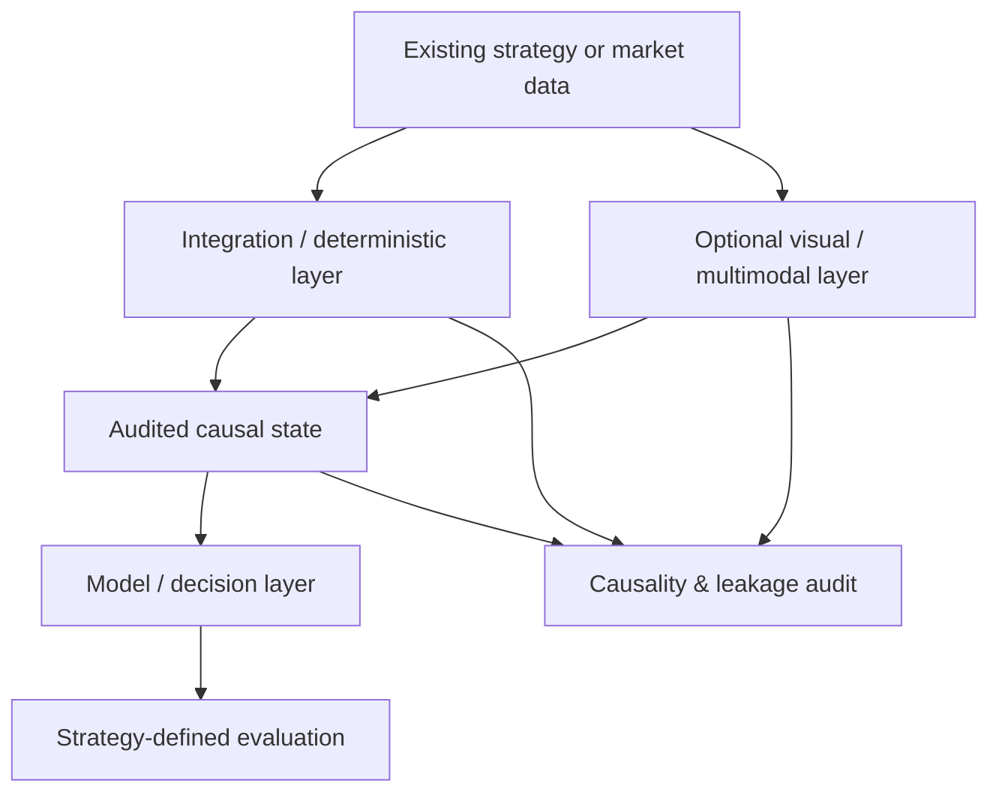

# Multimodal Market AI

**Add causal numerical and multimodal AI to an existing EA, bot or research strategy without rewriting the strategy itself.**

[](LICENSE)
[](https://www.python.org/)
[](#project-status)

Multimodal Market AI is an open-source, strategy-agnostic framework for adding **causal market context, numerical models, chart/vision models and auditable AI decision layers** to trading systems that already exist.

You do **not** need to replace a mature bot or expose its proprietary rules. An existing MT4/MT5 EA, Python bot, backtester or private strategy can keep producing its own candidates, signals or state. This project provides a boundary around that system so you can attach synchronized market context, build leakage-safe datasets, compare simple numerical baselines with multimodal models, cache expensive model representations and validate everything before allowing an AI output to influence live decisions.

> This is a research and engineering framework, not a signal service, a ready-made trading strategy, or a promise of profitability.

## Already have a trading bot? Start here

If you have a large existing codebase, the intended workflow is **augmentation, not replacement**:

```text
existing EA / bot / strategy
        |
        | timestamped candidates, state, features
        v
integration adapter
        |
        +--> causal market context
        +--> synchronized higher-timeframe context
        +--> numerical features
        +--> optional chart / VLM representation
        |
        v
AI / statistical layer
        |
        +--> score or ranking
        +--> context / regime estimate
        +--> risk or uncertainty estimate
        +--> optional continuation / deterioration estimate
        |
        v
research report, read-only live validation,
or an output consumed by your existing bot
```

The strategy remains yours. The AI layer can be developed and tested independently.

Three common integration paths are documented:

1. **Python bot → direct DataFrame/API integration**;
2. **MT4/MT5 EA → CSV/JSON/SQLite/IPC bridge → Python AI layer**;
3. **historical bot decisions → offline dataset → model comparison → read-only forward validation**.

See [Integrating an existing bot or EA](docs/INTEGRATING_EXISTING_BOTS.md) and the runnable [existing-bot integration example](examples/existing_bot_integration.py).

## What this project can add to an existing system

The public core is useful even when your entry/exit logic stays completely private. It can provide or support:

- causal alignment of market context to the exact decision timestamp;
- higher-timeframe construction without using information that was not yet available;
- exact train/validation/test separation and purging when an outcome extends across a split boundary;
- feature-availability audits that fail when a feature arrives after the decision time;
- immutable candidate/artifact manifests, hashes and exact record-ID checks;
- resumable, dependency-aware caches for expensive model inference;
- numerical baselines before spending GPU time on multimodal models;
- frozen VLM representations that can be compared against tabular models on the same rows;
- read-only forward validation before any execution integration;
- strategy-specific evaluation while keeping private rules outside the public repository.

A model is only useful if it improves the system under a fair comparison. The framework therefore treats **"the AI did not add useful information" as a valid result**, not as a reason to force more training.

## Why this project exists

Many market-AI experiments mix feature calculation, chart perception, target creation, candidate selection and economic evaluation into one pipeline. That makes results difficult to reproduce and makes leakage surprisingly easy.

Multimodal Market AI separates those responsibilities:



The framework is intended for research on **Forex, indices, commodities, equities, crypto and other time-series markets**. The public core does not prescribe a proprietary trading method or private timeframe ladder.

## Core principles

- **Bring your own strategy** — an existing system can remain intact and private.
- **Causal by construction** — context must be closed and available at the decision timestamp.
- **No target leakage** — future outcomes and retrospective information stay outside model inputs.
- **Multi-timeframe first** — configurable hierarchies are synchronized rather than treated as unrelated datasets.
- **Multimodal when useful** — numerical features, sequences, charts and VLM outputs can coexist.
- **Baseline before complexity** — compare simple models before expensive multimodal training.
- **Reproducible** — manifests, hashes, exact IDs, checkpoints, seeds and runtime measurements are first-class outputs.
- **Fail closed** — missing required inputs, stale cache metadata or causal violations stop the pipeline instead of being silently ignored.
- **Predictive skill is not profitability** — model metrics and economic evaluation are separate questions.

## Current public capabilities

The repository currently includes:

- causal OHLCV aggregation and backward-only higher-timeframe alignment;
- explicit causality and feature-availability audits;
- typed market-state primitives;
- R-multiple evaluation with asymmetric payoff support;
- artifact sealing, dependency fingerprints and exact record-ID validation;
- purged temporal split helpers and training-only preprocessing statistics;
- resumable chunk-cache primitives with atomic writes;
- a reproducible synthetic candidate workflow;
- a generic adapter for attaching causal market context to events emitted by an existing bot;
- tests designed to fail on common leakage, stale-artifact and identity errors;
- documentation for VLM/fine-tuning and read-only forward-validation workflows.

For what has been demonstrated internally and what remains open, see [Project status and research evidence](docs/PROJECT_STATUS.md).

## What we learned the hard way

This repository also documents failure modes encountered during internal research so other users do not need to rediscover them. Examples include:

- confusing a persistent state with a transient confirmation;
- treating missing/unknown data as if it were a real neutral class;
- comparing columns with the same-looking name but different semantic roles;
- silently skipping a required source file because it was absent from a manifest;
- reusing a cache merely because the output file exists;
- fitting normalization on validation/test data;
- splitting by decision timestamp while the target path crosses the split boundary;
- allowing retrospective/audit-only information into model features;
- tuning repeatedly on a protected test set;
- spending GPU time before establishing a cheap numerical baseline.

See [Failure modes and lessons learned](docs/LESSONS_LEARNED.md).

## Minimal existing-bot example

An existing bot can emit a row whenever it creates a candidate or decision. The framework can attach the latest market bar that was actually closed at that moment:

```python
import pandas as pd

from multimodal_market_ai.integration import attach_causal_market_context

bot_events = pd.DataFrame(
    {
        "event_id": ["evt-1", "evt-2"],
        "decision_ts": ["2026-01-01T10:07:00Z", "2026-01-01T10:10:00Z"],
        "symbol": ["SYNTH", "SYNTH"],
        "bot_state": [0.25, 0.62],
    }
)

bars = pd.DataFrame(
    {
        "open": [100.0, 101.0],
        "high": [102.0, 103.0],
        "low": [99.0, 100.0],
        "close": [101.0, 102.0],
    },
    index=pd.to_datetime(["2026-01-01T10:05:00Z", "2026-01-01T10:10:00Z"]),
)

context = attach_causal_market_context(bot_events, bars)
print(context)
```

The event at `10:07` can see only the bar closed at `10:05`; the event at `10:10` may use the `10:10` close. The bot-specific `bot_state` is preserved unchanged.

## From an existing strategy to an AI-assisted system

A practical development path is:

```text
existing bot decisions
    -> immutable timestamped export
    -> causal market/context attachment
    -> feature and leakage audit
    -> purged train / validation / test split
    -> naive + tabular baseline
    -> optional chart/VLM representation
    -> compare incremental value on identical rows
    -> read-only live validation
    -> optional integration of model output back into the bot
```

The last step is optional. A user may keep the AI permanently read-only and use it only for analysis, ranking or monitoring.

## Research results: what is useful to transfer

Internal work has reinforced several general conclusions without requiring publication of any private strategy:

- corrected causal datasets can materially change earlier conclusions, so target and state contracts must be versioned and audited;
- lightweight numerical models can contain useful out-of-sample information and should be the first comparison point;
- a frozen multimodal representation can be tested independently, and further fine-tuning should be stopped when it does not add meaningful incremental value over the numerical baseline;
- predictive improvement does not by itself establish a positive economic edge;
- expensive inference should be resumable, dependency-bound and exactly matched to the same candidate population used by cheaper baselines;
- post-decision / post-entry state can be studied as a separate modelling problem rather than forcing every AI component to predict entry signals.

Private strategy rules, private datasets, private target definitions and private economic results are deliberately excluded.

## Quick start

```bash
git clone https://github.com/bobbonauta/Multimodal-Market-AI.git
cd Multimodal-Market-AI
python -m venv .venv
```

Linux/macOS:

```bash
source .venv/bin/activate
pip install -e ".[dev]"
pytest
python examples/existing_bot_integration.py
```

Windows PowerShell:

```powershell
.\.venv\Scripts\Activate.ps1
pip install -e ".[dev]"
pytest
python examples\existing_bot_integration.py
```

## Reference hardware

The research path has used ordinary consumer hardware as well as CPU-only infrastructure. A reference local environment uses a Ryzen 7 5700X3D, RTX 4070 SUPER 12 GB and 64 GB RAM; CPU-only systems remain useful for data preparation, audits and lightweight baselines. See [Reference research environment](docs/RESEARCH_ENVIRONMENT.md) and [Benchmarking guide](docs/BENCHMARKING.md).

## AI-assisted research and engineering

The project has used multiple AI assistants for implementation, repository review and research planning. The human maintainer defines domain constraints and acceptance criteria; reproducible code, tests and artifacts remain the source of truth. AI-generated changes are not accepted as evidence merely because an assistant reports `PASS`.

## Planned architecture

```text
existing strategy / market data
   |
   +-- integration adapter
   +-- causal timeframe builder
   +-- deterministic feature engines
   +-- sequence encoders
   +-- chart renderer
   +-- VLM adapters
             |
             v
      structured / learned state
             |
             v
       decision or ranking head
             |
             v
      strategy-defined evaluation
```

Planned model adapters include open multimodal families where licensing permits. Model support is added only with reproducible tests and clear provenance.

## We want contributors

Useful contributions include:

- adapters for existing Python bots, MT4/MT5 bridges and backtest exports;
- public-data connectors with redistribution-safe licensing;
- numerical/sequence baselines;
- chart renderers and VLM adapters;
- leakage-detection and temporal-split tests;
- resumable cache and checkpoint tooling;
- consumer-GPU and CPU benchmarks;
- Linux/Windows portability;
- read-only forward-validation connectors.

A contribution does not need to reveal a trading strategy. Generic infrastructure and reproducible integration examples are enough.

## What this repository will not contain

The public repository should not contain:

- proprietary strategy rules or private signal semantics;
- private/licensed datasets that cannot be redistributed;
- API keys, broker credentials or account data;
- claims of guaranteed profitability;
- future information disguised as features;
- model weights whose licenses do not allow redistribution.

## Project status

**Early alpha.** The integration and causal core are usable research primitives, while model adapters and end-to-end examples are still expanding.

The objective is not to ship a universal trading bot. It is to provide a clean way to **add, test and reject AI components around an existing market system without corrupting causality or forcing the original strategy to be rewritten**.

## Documentation

- [Integrating an existing bot or EA](docs/INTEGRATING_EXISTING_BOTS.md)
- [Failure modes and lessons learned](docs/LESSONS_LEARNED.md)
- [Project status and research evidence](docs/PROJECT_STATUS.md)
- [Historical data sources and preparation](docs/DATA_SOURCES.md)
- [Model adapter architecture](docs/MODEL_ADAPTERS.md)
- [Fine-tuning guide](docs/FINETUNING_GUIDE.md)
- [Architecture](docs/ARCHITECTURE.md)
- [Trading-system research patterns](docs/TRADING_SYSTEM_PATTERNS.md)
- [Reference research environment](docs/RESEARCH_ENVIRONMENT.md)
- [Benchmarking guide](docs/BENCHMARKING.md)
- [Roadmap](docs/ROADMAP.md)
- [Repository governance](docs/REPOSITORY_GOVERNANCE.md)
- [Contributing](CONTRIBUTING.md)

## Disclaimer

This software is provided for research and educational purposes. Financial markets involve risk. Nothing in this repository constitutes investment advice, a recommendation to trade, or a guarantee of future performance.

## License

Code in this repository is licensed under the Apache License 2.0. Datasets, model weights and third-party models may be governed by separate licenses.
