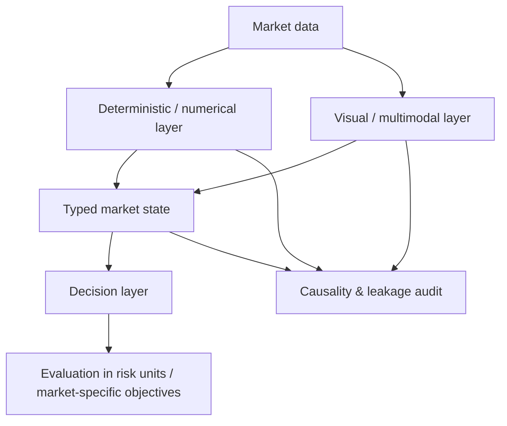

# Multimodal Market AI

**Open-source multimodal, multi-timeframe and causal AI research for Forex and financial markets.**

[](LICENSE)
[](https://www.python.org/)
[](#project-status)

Multimodal Market AI is a strategy-agnostic research framework for combining **numerical market data**, **multi-timeframe structure**, **chart/vision models**, and **structured decision layers** while preserving strict temporal causality.

The long-term goal is to make it easier to experiment with AI systems that can learn from markets the way a human analyst does: not from a single flat feature vector, but from several synchronized time scales, numerical context, visual context and explicit state representations.

> This is a research and engineering project, not a signal service, trading bot, or promise of profitability.

## Why this project exists

Most market-AI experiments collapse very different problems into one model: feature calculation, chart perception, regime/context recognition, signal generation and economic evaluation. That makes results difficult to reproduce and makes leakage surprisingly easy.

This project separates those responsibilities.



The framework is intended for research on **Forex, indices, commodities, equities, crypto and other time-series markets**. Nothing in the core should depend on a proprietary trading method.

## Core principles

- **Causal by construction** — higher-timeframe context must be closed and available at the lower-timeframe decision timestamp.
- **No target leakage** — future outcomes and POST information are kept outside model inputs.
- **Multi-timeframe first** — M5/H1/H8, M15/H2/H12, M30/H4/D1 and other hierarchies are treated as synchronized structures rather than unrelated datasets.
- **Multimodal** — numerical features, OHLC/indicator sequences, rendered charts and VLM outputs can coexist without forcing one model to relearn exact deterministic calculations.
- **Strategy-agnostic** — the public core provides infrastructure; users define their own states, targets and market logic.
- **Reproducible** — manifests, hashes, checkpoints, seeds and hardware/runtime measurements are first-class outputs.
- **Local-first** — useful work should run on ordinary CPUs/GPUs where possible; expensive cloud GPUs are reserved for workloads that actually need them.
- **Economic metrics are not classification accuracy** — market systems may be profitable with low win rates when payoff distributions are asymmetric. Evaluation modules should support expectancy, profit factor, drawdown and full return distributions rather than optimize only for “winning trades”.

## What is in the first public version

The initial version deliberately starts small and auditable. It provides the foundation that later VLM/fine-tuning modules can build on:

- causal OHLCV aggregation from a base timeframe to higher timeframes;
- backward-only alignment of completed higher-timeframe bars;
- explicit leakage checks;
- typed market-state primitives;
- a reproducible synthetic quickstart;
- tests that fail if future higher-timeframe information is introduced;
- project architecture and roadmap for multimodal/VLM extensions.

## Quick start

```bash
git clone https://github.com/bobbonauta/Multimodal-Market-AI.git
cd Multimodal-Market-AI
python -m venv .venv
```

Linux/macOS:

```bash
source .venv/bin/activate
pip install -e ".[dev]"
pytest
python examples/quickstart.py
```

Windows PowerShell:

```powershell
.\.venv\Scripts\Activate.ps1
pip install -e ".[dev]"
pytest
python examples\quickstart.py
```

## Minimal example

```python
import pandas as pd

from multimodal_market_ai.timeframes import (
    align_closed_higher_timeframe,
    resample_ohlcv_close_indexed,
)

m5 = pd.DataFrame(
    {
        "open": [1.00, 1.01, 1.02, 1.03],
        "high": [1.02, 1.03, 1.04, 1.05],
        "low": [0.99, 1.00, 1.01, 1.02],
        "close": [1.01, 1.02, 1.03, 1.04],
        "volume": [10, 12, 9, 11],
    },
    index=pd.to_datetime(
        ["2026-01-01 00:05Z", "2026-01-01 00:10Z", "2026-01-01 00:15Z", "2026-01-01 00:20Z"]
    ),
)

m15 = resample_ohlcv_close_indexed(m5, "15min")
aligned = align_closed_higher_timeframe(m5, m15, prefix="htf_")

print(aligned)
```

The API assumes timestamps represent **bar close times**. A higher-timeframe row is visible only when its close timestamp is less than or equal to the lower-timeframe decision timestamp.

## Planned architecture

```text
market data
   |
   +-- causal timeframe builder
   +-- deterministic feature engines
   +-- sequence encoders
   +-- chart renderer
   +-- VLM adapters
             |
             v
      structured market state
             |
             v
       decision / ranking heads
             |
             v
      strategy-defined evaluation
```

Planned adapters and experiments include InternVL, Qwen-VL/Qwen-VL-family models, Gemma-family multimodal models and lightweight numerical/sequence baselines. Model support will be added only with reproducible tests and clear licensing notes.

## We want contributors

This project is intentionally open because useful improvements can come from people running completely different experiments on their own machines.

You do **not** need to donate compute or join a P2P network. Clone the project, use it for your own research, improve something that matters to you, and send a pull request if the improvement is generalizable.

Particularly useful contributions include:

- NVIDIA / AMD / Intel GPU compatibility and profiling;
- lower-VRAM inference and fine-tuning recipes;
- faster VLM batching without changing outputs;
- Qwen, InternVL, Gemma and other multimodal backends;
- multi-timeframe renderers;
- causal sequence-model baselines;
- leakage-detection tests;
- checkpoint/resume tooling;
- cache and dataset tooling;
- benchmark results from consumer GPUs;
- Linux/Windows portability;
- public-market-data connectors with redistribution-safe licensing.

If you have an RTX 3060, 3090, 4070, 4090, 5090, an AMD GPU, a workstation, or just a CPU machine, your reproducible benchmark can still be useful.

See [CONTRIBUTING.md](CONTRIBUTING.md) and the [roadmap](docs/ROADMAP.md).

## What this repository will not contain

To keep the project useful and legally clean, the public repository should not contain:

- private or licensed market datasets that cannot be redistributed;
- API keys, broker credentials or account data;
- proprietary trading methods contributed without permission;
- claims of guaranteed profitability;
- future information disguised as model features;
- model weights whose license does not allow redistribution.

Users remain responsible for the licenses and terms of datasets and base models they choose to use.

## Project status

**Early alpha.** The repository is being built in public. APIs may change while the causal core and multimodal interfaces stabilize.

The first milestone is not “build a profitable bot”. It is:

> Build a clean, reproducible and extensible research stack where numerical models and multimodal AI can be compared fairly across multiple market timeframes without temporal leakage.

## Research directions

Some questions we want to investigate openly:

- Can deterministic event gates reduce expensive VLM calls without losing important market states?
- How much visual context is actually useful beyond numerical state representations?
- Can a typed intermediate market state improve transfer between different model families?
- Which consumer GPUs provide the best fine-tuning throughput per dollar?
- How stable are multimodal readers across symbols, asset classes and timeframes?
- When does batching change autoregressive multimodal outputs?
- Can cached visual interpretation make large historical experiments practical?
- Which evaluation metrics remain meaningful when profitable systems have asymmetric payoff distributions and relatively low win rates?

## Disclaimer

This software is provided for research and educational purposes. Financial markets involve risk. Nothing in this repository constitutes investment advice, a recommendation to trade, or a guarantee of future performance.

## License

Code in this repository is licensed under the **Apache License 2.0**. See [LICENSE](LICENSE).

Datasets, model weights and third-party models may be governed by separate licenses and are not automatically covered by Apache-2.0.
